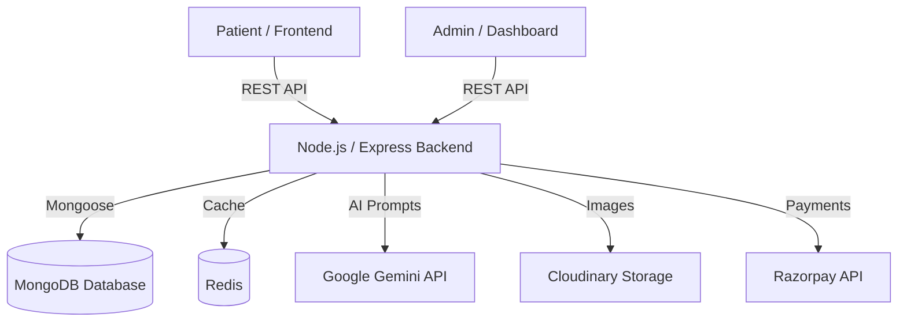
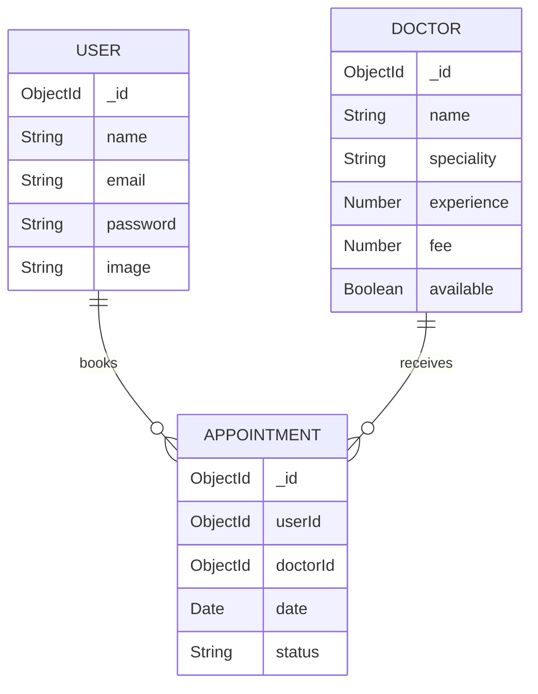

# 🏥 Doctor Appointment System

A comprehensive, AI-powered Full-Stack Doctor Appointment System built with the MERN stack.

## 📌 Overview
This project is a complete healthcare appointment booking system that connects patients with doctors. It features an AI-powered Symptom Checker and a Medical Assistant Chatbot, helping patients find the right specialist based on their symptoms. The platform includes a patient-facing frontend, a secure administrative dashboard, and a robust backend API.

## 🚀 Live Demo

* **Patient Frontend**: [https://healthcaredoctorappointment-green.vercel.app/](https://healthcaredoctorappointment-green.vercel.app/)
* **Admin Dashboard**: [https://healthcareadmindoctorpanel.vercel.app/](https://healthcareadmindoctorpanel.vercel.app/)
* **Backend API**: [https://doctor-appointment-project-bsfl.onrender.com/](https://doctor-appointment-project-bsfl.onrender.com/)

## ✨ Features

### Patient Features (Frontend)
* User Registration & Authentication
* Browse Doctors by Speciality
* Book, View, and Cancel Appointments
* Manage User Profile
* 🤖 **AI Symptom Checker**: Predicts the required medical specialist based on patient symptoms.
* 💬 **AI Medical Chatbot**: Natural language assistant recommending doctors and providing availability status.
* Online Payments (via Razorpay)

### Admin Features (Admin Dashboard)
* Admin Login & Secure Access
* Manage Doctors (Add, Update, Delete)
* View All Appointments

### Backend & Core
* RESTful API Architecture
* Image Uploads via Cloudinary
* Redis Caching Integration
* Google Gemini AI Integration

---

## 🏗️ System Architecture



---

## 🔄 Application Flow

1. Patient visits the platform and either browses doctors or uses the **AI Chatbot / Symptom Checker** for recommendations.
2. Patient registers or logs in to their account.
3. Patient selects a doctor and books an appointment slot.
4. Backend verifies availability and processes the payment (Razorpay).
5. Appointment is saved in the database (MongoDB).
6. Admin can log in to the dashboard to view and manage appointments and doctors.

---

## 📂 Project Structure

```text
Doctor-Appointment-Project/
├── admin/                 # React Admin Dashboard
│   ├── src/
│   │   ├── pages/         # Admin & Doctor pages
│   │   └── ...
├── backend/               # Express/Node.js API Server
│   ├── config/            # DB, Redis, Cloudinary, Gemini Configs
│   ├── controllers/       # Business logic (AI, Chatbot, Users, etc.)
│   ├── middlewares/       # Auth & Validation
│   ├── models/            # Mongoose Schemas (User, Doctor, Appointment)
│   ├── routes/            # API Endpoints
│   └── server.js          # Entry point
└── frontend/              # React Patient Application
    ├── src/
    │   ├── components/    
    │   ├── context/
    │   └── pages/         # Home, Appointments, SymptomChecker, etc.
```

---

## 🛠️ Tech Stack

| Technology | Purpose |
| ---------- | ------- |
| **React (Vite)** | Frontend & Admin UI |
| **Tailwind CSS** | Styling |
| **Node.js** | Backend Runtime |
| **Express.js** | API Framework |
| **MongoDB** | Primary Database |
| **Redis** | Caching |
| **JWT & bcrypt** | Authentication & Security |
| **Cloudinary** | Image Storage (Doctor profiles) |
| **Razorpay** | Payment Gateway |
| **Google Gemini 3.5** | AI Symptom Checker & Chatbot |

---

## 🗄️ Database Design



---

## 🔌 API Documentation

Here are some of the key AI endpoints implemented in the system:

| Method | Endpoint | Description | Authentication |
| ------ | -------- | ----------- | -------------- |
| POST | `/api/ai/predict-specialist` | Predicts doctor specialty based on symptoms | No |
| POST | `/api/chat/ask` | Interact with the AI Medical Assistant | No |

### Example Request: Symptom Checker

```http
POST /api/ai/predict-specialist
Content-Type: application/json
```

```json
{
  "symptoms": ["Fever", "Cough"]
}
```

---

## 🔐 Authentication & Security

* **Authentication**: Token-based authentication using JSON Web Tokens (JWT).
* **Password Hashing**: User passwords are encrypted using `bcrypt` before database storage.
* **CORS Middleware**: Configured to restrict/allow cross-origin requests securely.
* **Environment Variables**: Sensitive data (Database URLs, API Keys, JWT secrets) are isolated via `dotenv`.

---

## ⚙️ Installation & Setup

### Prerequisites

* Node.js
* npm
* MongoDB (Local or Atlas)
* Redis (Local or Cloud)
* External API Keys (Cloudinary, Razorpay, Google Gemini)

### Clone Repository

```bash
git clone <repository-url>
cd Doctor-Appointment-Project
```

### Install Dependencies

You need to install dependencies for all three parts of the application:

```bash
# Install backend dependencies
cd backend
npm install

# Install frontend dependencies
cd ../frontend
npm install

# Install admin dependencies
cd ../admin
npm install
```

### Environment Variables

Create a `.env` file in the `backend/` directory:

```env
PORT=4000
MONGODB_URI=your_mongodb_connection_string
JWT_SECRET=your_jwt_secret

# Cloudinary Integration
CLOUDINARY_NAME=your_cloudinary_name
CLOUDINARY_API_KEY=your_cloudinary_api_key
CLOUDINARY_SECRET_KEY=your_cloudinary_secret_key

# Payment Gateway
RAZORPAY_KEY_ID=your_razorpay_key_id
RAZORPAY_KEY_SECRET=your_razorpay_key_secret

# AI Integration
GEMINI_API_KEY=your_google_gemini_api_key

# Redis
REDIS_URL=your_redis_connection_string
```

### Run the Project

Open three separate terminals to start the servers concurrently:

```bash
# Terminal 1: Backend
cd backend
npm run server

# Terminal 2: Frontend
cd frontend
npm run dev

# Terminal 3: Admin Dashboard
cd admin
npm run dev
```

---

## 📸 Screenshots / Demo

> Add application screenshots here.

### Home Page


### Dashboard


---

## 🧪 Testing

> Automated tests are not currently included.

---

## 🤖 AI Features

This project leverages the **Google Gemini 3.5 Flash** model via the `@google/genai` SDK to provide intelligent healthcare functionality:

* **Symptom Checker**: Translates a user's natural language symptoms into a recommended medical specialty. It strictly routes patients to existing hospital departments (e.g., Cardiologist, Dermatologist, General physician).
* **AI Medical Chatbot**: A contextual assistant provided with real-time hospital doctor data from MongoDB. It helps users find specific doctors, check availability, answer basic queries, and formats recommendations as clickable Markdown links routing directly to booking pages.
* **Resilience**: The AI controllers include custom Retry/Backoff logic to gracefully handle `429` (Rate Limit) and `503` (Service Unavailable) errors from the Gemini API.

---

## ⚡ Performance & Scalability

* **Redis Caching**: Implemented to speed up API responses and reduce load on the primary database.
* **AI Error Handling**: Polling and retry mechanism prevents app crashes during high API demand.

---

## 🧩 Challenges & Technical Decisions

* **AI Context Management** → **Approach**: Sent stringified JSON of doctor records directly into the system prompt of the Gemini AI model. → **Why**: Ensures the Chatbot only recommends real, available doctors currently registered in the database, avoiding AI hallucinations.
* **Markdown Formatting** → **Approach**: Prompt-engineered the AI to return doctor names mapped strictly to frontend UI routing slugs (e.g., `[Dr. Swastik Sharma](/appointment/dr-swastik-sharma)`). → **Why**: Makes the chatbot conversational output actionable and deeply integrated with the React frontend.

---

## 📈 Future Improvements

* Improved test coverage (e.g., Jest, React Testing Library)
* Automated CI/CD pipeline deployment
* Dockerization (`Dockerfile` and `docker-compose.yml`)
* WebSockets for real-time notifications

---

## 📄 License

No license has currently been specified.

---

## ⭐ Project Highlights

* Complete Full-Stack MERN Architecture
* Advanced Google Gemini AI Integrations
* Redis caching for optimization
* Secure Payment Gateway implementation
* Dual React frontends (Patient UI & Admin Panel)
