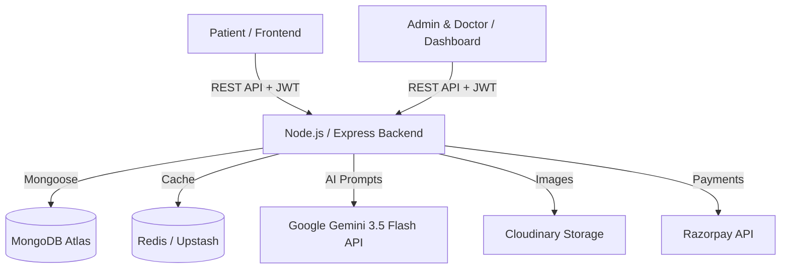
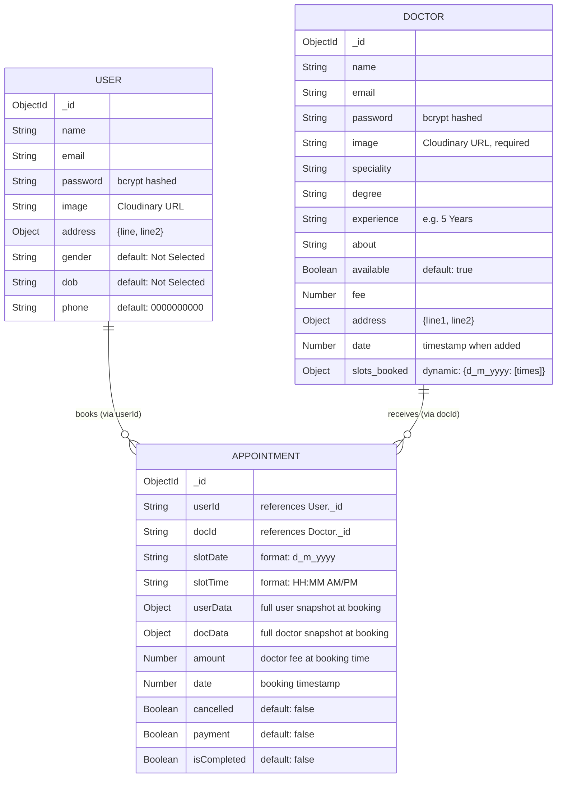

# 🏥 Doctor Appointment System

A comprehensive, AI-powered Full-Stack Doctor Appointment System built with the MERN stack.

## 📌 Overview
This project is a complete healthcare appointment booking system that connects patients with doctors. It features an AI-powered Symptom Checker and a Medical Assistant Chatbot, helping patients find the right specialist based on their symptoms. The platform includes a patient-facing frontend, a secure administrative dashboard with a doctor panel, and a robust backend API.

## 🚀 Live Demo

* **Patient Frontend**: [https://healthcaredoctorappointment-green.vercel.app/](https://healthcaredoctorappointment-green.vercel.app/)
* **Admin Dashboard**: [https://healthcareadmindoctorpanel.vercel.app/](https://healthcareadmindoctorpanel.vercel.app/)
* **Backend API**: [https://doctor-appointment-project-bsfl.onrender.com/](https://doctor-appointment-project-bsfl.onrender.com/)

## ✨ Features

### Patient Features (Frontend)
* User Registration & Authentication
* Browse Doctors by Speciality
* Book, View, and Cancel Appointments
* 30-Minute Appointment Slots (10 AM–1 PM & 5 PM–8 PM, 7-day rolling window)
* Manage User Profile (including profile image upload via Cloudinary)
* 🤖 **AI Symptom Checker**: Predicts the required medical specialist based on patient symptoms.
* 💬 **AI Medical Chatbot**: Natural language assistant recommending doctors with clickable booking links and providing availability status.
* Online Payments (via Razorpay)
* 🌙 Dark Mode / Light Mode Toggle

### Doctor Features (Admin Dashboard)
* Doctor Login & Secure Access
* View Own Appointments
* Mark Appointments as Completed or Cancelled
* View Earnings Dashboard
* Update Profile (Fee, Address, Availability)

### Admin Features (Admin Dashboard)
* Admin Login & Secure Access
* Add New Doctors (with image upload to Cloudinary)
* Toggle Doctor Availability
* View All Appointments
* Cancel Appointments
* Dashboard Analytics (Total Doctors, Patients, Appointments, Latest 5 Appointments)

### Backend & Core
* RESTful API Architecture
* JWT-based Role Authentication (Patient, Doctor, Admin)
* Image Uploads via Cloudinary
* Redis Caching with Manual Cache Invalidation
* Google Gemini AI Integration with Retry/Backoff Logic

---

## 🏗️ System Architecture


```mermaid
flowchart TD
    Patient[Patient / Frontend] -->|REST API + JWT| Backend[Node.js / Express Backend]
    AdminUser[Admin & Doctor / Dashboard] -->|REST API + JWT| Backend
    Backend -->|Mongoose| MongoDB[(MongoDB Atlas)]
    Backend -->|Cache| Redis[(Redis / Upstash)]
    Backend -->|AI Prompts| Gemini[Google Gemini 3.5 Flash API]
    Backend -->|Images| Cloudinary[Cloudinary Storage]
    Backend -->|Payments| Razorpay[Razorpay API]
```

---

## 🔄 Application Flow

1. Patient visits the platform and either browses doctors or uses the **AI Chatbot / Symptom Checker** for recommendations.
2. Patient registers or logs in to their account.
3. Patient selects a doctor, picks an available 30-minute time slot, and books an appointment.
4. Backend verifies slot availability and saves the appointment with a snapshot of user and doctor data.
5. Patient can pay for the appointment online via Razorpay.
6. Doctor can log in to view, complete, or cancel their appointments.
7. Admin can log in to the dashboard to add doctors, manage appointments, toggle availability, and view analytics.

---

## 📂 Project Structure

```text
Doctor-Appointment-Project/
├── admin/                 # React Admin & Doctor Dashboard (Vite)
│   ├── src/
│   │   ├── components/    # Navbar, Sidebar, Logo
│   │   ├── context/       # AdminContext, DoctorContext, AppContext
│   │   └── pages/
│   │       ├── Admin/     # Dashboard, DoctorsList, AddDoctor, AllAppointments
│   │       ├── Doctor/    # DoctorDashboard, DoctorAppointments, DoctorProfile
│   │       └── Login.jsx
├── backend/               # Express/Node.js API Server
│   ├── config/            # MongoDB, Redis, Cloudinary, Gemini Configs
│   ├── controllers/       # Business logic (AI, Chatbot, Users, Admin, Doctors)
│   ├── middlewares/       # authUser, authAdmin, authDoctor, Multer
│   ├── models/            # Mongoose Schemas (User, Doctor, Appointment)
│   ├── routes/            # API Endpoints (user, admin, doctor, ai, chatbot)
│   └── server.js          # Entry point
└── frontend/              # React Patient Application (Vite)
    ├── src/
    │   ├── components/    # Navigation, Chatbot, Header, Footer, etc.
    │   ├── context/       # AppContext (global state)
    │   └── pages/         # Home, Doctor, Appointment, SymptomChecker, etc.
```

---

## 🛠️ Tech Stack

| Technology | Purpose |
| ---------- | ------- |
| **React 19 (Vite)** | Frontend & Admin UI |
| **Tailwind CSS 4** | Styling |
| **Node.js** | Backend Runtime |
| **Express.js 5** | API Framework |
| **MongoDB (Atlas)** | Primary Database |
| **Mongoose 8** | ODM for MongoDB |
| **Redis (Upstash)** | Caching (Doctor listing API) |
| **JWT & bcrypt** | Authentication & Password Hashing |
| **Cloudinary** | Image Storage (Doctor & User profiles) |
| **Multer** | File Upload Handling (Memory Storage) |
| **Razorpay** | Payment Gateway |
| **Google Gemini 3.5 Flash** | AI Symptom Checker & Chatbot |
| **@google/genai** | Google Gemini SDK |
| **react-markdown** | Rendering AI chatbot Markdown responses |
| **react-toastify** | Toast Notifications |
| **Axios** | HTTP Client (Frontend) |

---

## 🗄️ Database Design


```mermaid
erDiagram
    USER ||--o{ APPOINTMENT : "books (via userId)"
    DOCTOR ||--o{ APPOINTMENT : "receives (via docId)"
    
    USER {
        ObjectId _id
        String name
        String email
        String password "bcrypt hashed"
        String image "Cloudinary URL"
        Object address "{line, line2}"
        String gender "default: Not Selected"
        String dob "default: Not Selected"
        String phone "default: 0000000000"
    }
    
    DOCTOR {
        ObjectId _id
        String name
        String email
        String password "bcrypt hashed"
        String image "Cloudinary URL, required"
        String speciality
        String degree
        String experience "e.g. 5 Years"
        String about
        Boolean available "default: true"
        Number fee
        Object address "{line1, line2}"
        Number date "timestamp when added"
        Object slots_booked "dynamic: {d_m_yyyy: [times]}"
    }
    
    APPOINTMENT {
        ObjectId _id
        String userId "references User._id"
        String docId "references Doctor._id"
        String slotDate "format: d_m_yyyy"
        String slotTime "format: HH:MM AM/PM"
        Object userData "full user snapshot at booking"
        Object docData "full doctor snapshot at booking"
        Number amount "doctor fee at booking time"
        Number date "booking timestamp"
        Boolean cancelled "default: false"
        Boolean payment "default: false"
        Boolean isCompleted "default: false"
    }
```

---

## 🔌 API Documentation

### User Endpoints (`/api/user`)

| Method | Endpoint | Description | Authentication |
| ------ | -------- | ----------- | -------------- |
| POST | `/api/user/register` | Register a new patient | No |
| POST | `/api/user/login` | Patient login | No |
| GET | `/api/user/get-profile` | Get logged-in user's profile | `authUser` |
| POST | `/api/user/update-profile` | Update profile (with optional image) | `authUser` |
| POST | `/api/user/book-appointment` | Book a doctor appointment | `authUser` |
| GET | `/api/user/appointment` | List all user's appointments | `authUser` |
| POST | `/api/user/cancel-appointment` | Cancel an appointment | `authUser` |
| POST | `/api/user/payment-razorpay` | Create Razorpay payment order | `authUser` |
| POST | `/api/user/verify-razorpay` | Verify Razorpay payment | `authUser` |

### Admin Endpoints (`/api/admin`)

| Method | Endpoint | Description | Authentication |
| ------ | -------- | ----------- | -------------- |
| POST | `/api/admin/login` | Admin login | No |
| POST | `/api/admin/add-doctor` | Add a new doctor (with image) | `authAdmin` |
| POST | `/api/admin/all-doctors` | Get all doctors list | `authAdmin` |
| POST | `/api/admin/change-availability` | Toggle doctor availability | `authAdmin` |
| GET | `/api/admin/appointments` | Get all appointments | `authAdmin` |
| POST | `/api/admin/cancel-appointment` | Cancel any appointment | `authAdmin` |
| GET | `/api/admin/dashboard` | Get dashboard analytics | `authAdmin` |

### Doctor Endpoints (`/api/doctor`)

| Method | Endpoint | Description | Authentication |
| ------ | -------- | ----------- | -------------- |
| GET | `/api/doctor/list` | Public doctor listing (Redis cached) | No |
| POST | `/api/doctor/login` | Doctor login | No |
| GET | `/api/doctor/appointments` | Get doctor's appointments | `authDoctor` |
| POST | `/api/doctor/complete-appointment` | Mark appointment as completed | `authDoctor` |
| POST | `/api/doctor/cancel-appointment` | Cancel an appointment | `authDoctor` |
| GET | `/api/doctor/dashboard` | Get doctor's dashboard data | `authDoctor` |
| GET | `/api/doctor/profile` | Get doctor's profile | `authDoctor` |
| POST | `/api/doctor/update-profile` | Update doctor's profile | `authDoctor` |

### AI Endpoints

| Method | Endpoint | Description | Authentication |
| ------ | -------- | ----------- | -------------- |
| POST | `/api/ai/predict-specialist` | Predicts doctor specialty based on symptoms | No |
| POST | `/api/chat/ask` | Interact with the AI Medical Assistant | No |

### Example Request: Symptom Checker

```http
POST /api/ai/predict-specialist
Content-Type: application/json
```

```json
{
  "symptoms": ["Fever", "Cough"]
}
```

### Example Response

```json
{
  "success": true,
  "specialist": "General physician"
}
```

---

## 🔐 Authentication & Security

* **Authentication**: Token-based authentication using JSON Web Tokens (JWT) with three role-based middleware (`authUser`, `authAdmin`, `authDoctor`).
* **Password Hashing**: Passwords are hashed using `bcrypt` with a salt factor of 10 before database storage.
* **Input Validation**: Email validation via `validator.isEmail()`, password strength checks, and duplicate email detection.
* **CORS Middleware**: Enabled via the `cors` package.
* **Environment Variables**: Sensitive data (Database URLs, API Keys, JWT secrets) are isolated via `dotenv`.

---

## ⚙️ Installation & Setup

### Prerequisites

* Node.js (v18+)
* npm
* MongoDB (Local or Atlas)
* Redis (Local or Cloud, e.g., Upstash)
* External API Keys (Cloudinary, Razorpay, Google Gemini)

### Clone Repository

```bash
git clone <repository-url>
cd Doctor-Appointment-Project
```

### Install Dependencies

You need to install dependencies for all three parts of the application:

```bash
# Install backend dependencies
cd backend
npm install

# Install frontend dependencies
cd ../frontend
npm install

# Install admin dependencies
cd ../admin
npm install
```

### Environment Variables

Create a `.env` file in the `backend/` directory:

```env
MONGOOSE_URI=your_mongodb_connection_string
JWT_SECRET=your_jwt_secret
ADMIN_EMAIL=admin@example.com
ADMIN_PASSWORD=your_admin_password

# Cloudinary Integration
CLOUDINARY_NAME=your_cloudinary_name
CLOUDINARY_API_KEY=your_cloudinary_api_key
CLOUDINARY_SECRET_KEY=your_cloudinary_secret_key

# Payment Gateway
RAZORPAY_KEY_ID=your_razorpay_key_id
RAZORPAY_KEY_SECRET=your_razorpay_key_secret
RAZORPAY_CURRENCY=INR

# AI Integration (Google Gemini)
CHATBOT_API_KEY=your_google_gemini_api_key

# Redis
REDIS_URL=your_redis_connection_string
```

Create a `.env` file in the `frontend/` directory:

```env
VITE_BACKEND_URL=http://localhost:4000
```

Create a `.env` file in the `admin/` directory:

```env
VITE_BACKEND_URL=http://localhost:4000
```

### Run the Project

Open three separate terminals to start the servers concurrently:

```bash
# Terminal 1: Backend
cd backend
npm run server

# Terminal 2: Frontend
cd frontend
npm run dev

# Terminal 3: Admin Dashboard
cd admin
npm run dev
```

---

## 🧪 Testing

> Automated tests are not currently included.

---

## 🤖 AI Features

This project leverages the **Google Gemini 3.5 Flash** model via the `@google/genai` SDK to provide intelligent healthcare functionality:

* **Symptom Checker**: The patient selects symptoms from a predefined list. The backend sends these to Gemini with a constrained system prompt that limits responses to only the 7 specialties available in the system (Cardiologist, Gastroenterologist, Dermatologist, Neurologist, Gynecologist, Pediatricians, General physician). The predicted specialty is used to filter and navigate the patient to the relevant doctors.
* **AI Medical Chatbot**: A contextual assistant that receives real-time hospital doctor data from MongoDB (injected as JSON into the system prompt). It helps users find specific doctors, check availability, and provides recommendations as clickable Markdown links (rendered via `react-markdown`) that route directly to booking pages via React Router.
* **Resilience**: Both AI controllers include custom Retry/Backoff logic (up to 3 retries with linearly increasing delays of 3s, 5s, 7s) to gracefully handle `429` (Rate Limit) and `503` (Service Unavailable) errors from the Gemini API.

---

## ⚡ Performance & Scalability

* **Redis Caching**: The `GET /api/doctor/list` endpoint uses Redis as a read-through cache with a 1-hour TTL. On cache miss, data is fetched from MongoDB and cached. Cache is explicitly invalidated (`DEL 'all_doctors'`) when admin toggles doctor availability.
* **AI Error Handling**: Retry mechanism with backoff prevents app crashes during high API demand.
* **Cloudinary CDN**: Doctor and user profile images are served from Cloudinary's global CDN for fast delivery.

---

## 🧩 Challenges & Technical Decisions

* **AI Context Management** → **Approach**: Sent `JSON.stringify()` of all doctor records directly into the system prompt of the Gemini AI model. → **Why**: Ensures the Chatbot only recommends real, available doctors currently registered in the database, avoiding AI hallucinations.
* **Markdown Formatting** → **Approach**: Prompt-engineered the AI to return doctor names as Markdown links mapped to frontend routing slugs (e.g., `[Dr. Swastik Sharma](/appointment/dr-swastik-sharma)`). The frontend uses `react-markdown` with a custom link handler to navigate via React Router. → **Why**: Makes chatbot output actionable and deeply integrated with the React frontend, including auth-checking before navigation.
* **Appointment Data Snapshots** → **Approach**: Full copies of user and doctor data are embedded in each appointment document at booking time. → **Why**: Ensures historical accuracy — if a doctor changes their fee later, the appointment record still shows the fee the patient agreed to.
* **Slot Booking Design** → **Approach**: Booked slots stored as a dynamic object on the doctor document (`slots_booked`). → **Why**: Fast O(1) lookup by date, no joins needed, simple to update.

---

## 📈 Future Improvements

* Add JWT token expiration and refresh token mechanism
* Implement rate limiting on API endpoints
* Add database indexes on `appointment.userId` and `appointment.docId`
* Implement pagination for list endpoints
* Add email/SMS notifications for appointment confirmations
* Improved test coverage (e.g., Jest, React Testing Library)
* Automated CI/CD pipeline deployment
* Dockerization (`Dockerfile` and `docker-compose.yml`)
* WebSockets for real-time notifications

---

## 📄 License

No license has currently been specified.

---

## ⭐ Project Highlights

* Complete Full-Stack MERN Architecture
* Advanced Google Gemini AI Integrations (Symptom Checker + Chatbot)
* Redis caching with manual cache invalidation
* Secure Payment Gateway implementation (Razorpay)
* Three-role JWT authentication (Patient, Doctor, Admin)
* Dual React frontends (Patient UI & Admin/Doctor Panel)
* Dark mode support across both frontends
* Cloudinary image upload pipeline
